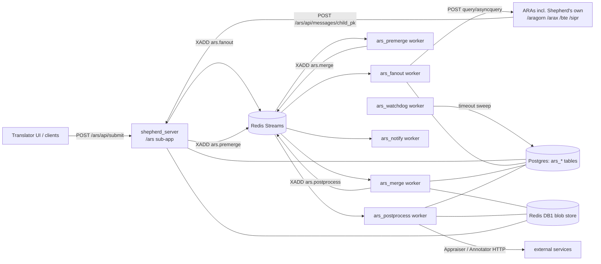

# Translator ARS → Shepherd Integration Plan

**Status:** Proposed
**Scope:** Re-host the NCATS Translator ARS ([NCATSTranslator/Relay](https://github.com/NCATSTranslator/Relay)) as a set of Shepherd workers + a Shepherd server sub-app, replacing its Django/Celery/RabbitMQ/MySQL runtime with Shepherd's FastAPI/Redis-Streams/Postgres infrastructure, while preserving externally observable ARS behavior exactly, as enforced by a parity test suite.

---

## 1. Background

### 1.1 What the ARS does today

The ARS (repo `NCATSTranslator/Relay`, Django 4.2 + Celery 5.5 on RabbitMQ, MySQL, Redis for channels/gates) is the Translator front door:

1. `POST /ars/api/submit` receives a TRAPI query, creates a **parent Message** row (`status='R'`, `code=202`), and responds `201` with a Django-serializer envelope (`{"model": "tr_ars.message", "pk": ..., "fields": {...}}`).
2. A post-save signal fans the query out to every **Actor** (one per ARA) whose channel list intersects the query's channels. Each fan-out creates a **child Message** (`ref` → parent) and a Celery task (`send-message-to-actor`) that POSTs the query to the ARA — `asyncquery` actors get a callback URL of `POST /ars/api/messages/<child_pk>`; `query` actors are called synchronously. Remote URLs are resolved via the SmartAPI registry filtered by `TR_ENV` maturity, with `config/config.yaml` overrides.
3. When a child result arrives (callback or sync response), it is validated (`reasoner-pydantic`), pre-merge processed (`scrub_null_attributes`, `decorate_edges_with_infores`, `normalize_scores`), and folded into a cumulative **merged message** (an `ars-ars-agent` child) under a `merge_semaphore` lock (`merge_and_post_process` Celery task, gated to 12 concurrent by a Redis token gate).
4. Each completed merge is **post-processed**: blocklist filtering, node annotation (biothings), Appraiser call, Sugeno-integral scoring, score stats. The parent's `merged_version` / `merged_versions_list` advance with each fold.
5. The parent completes (`status='D'`, `code=200`) when all children are terminal **and** every result-bearing ARA child has a corresponding completed merge (count parity). Celery beat sweeps every 3 minutes and times out stuck children (`code=598`).
6. The UI polls `GET /ars/api/messages/<parent>?trace=y` and `POST /ars/api/get_status/`; subscribed clients get HMAC-signed push notifications.

### 1.2 Why move it into Shepherd

Shepherd already provides, battle-tested: a Redis-Streams task fabric with consumer groups, orphan reclaim, and poison-pill dead-lettering (`shepherd_utils/shared.py`, `reclaim.py`); distributed per-response locks (`broker.py:191-296`); a locked, batched, process-pool merge substrate (`workers/merge_message`); zstd+orjson blob storage with TTLs (`db.py`); Postgres query state; OTel tracing; worker heartbeats and a monitor. The ARS's Celery/RabbitMQ/MySQL stack duplicates all of this with weaker operational properties (busy DB polling, unbounded MySQL blobs, beat-based sweeps). Hosting the ARS in Shepherd collapses two deployments into one and puts ARS behavior under Shepherd's observability.

Note the topology inversion: today the ARS sits *in front of* Shepherd (it fans out to `ara-shepherd-aragorn/arax/bte`). After integration, Shepherd hosts both roles; the ARS workers keep calling ARA endpoints over HTTP exactly as before — including Shepherd's own `/{ara}/asyncquery` endpoints, which remain plain HTTP targets resolved through SmartAPI. No special-casing of "local" ARAs in v1 (that is a later optimization, explicitly out of parity scope).

---

## 2. Goals and non-goals

### Goals

- G1. All ARS HTTP endpoints under `/ars/...` are served by `shepherd_server` with identical paths, methods, status codes, and response shapes (including the Django-serializer envelope and long-form status names).
- G2. All ARS background behavior (fan-out, child lifecycle, merge, post-process, timeout sweep, notifications) runs as Shepherd workers on Redis Streams.
- G3. A parity test suite (§7) locks in observable behavior; the port must pass it against golden fixtures generated from the original ARS.
- G4. ARS code is reused where it is framework-independent (`utils.py` merge/filter/scoring logic, SmartAPI discovery) — ported near-verbatim to maximize parity confidence.

### Non-goals (explicit behavior drops — need sign-off)

- N1. **Django admin** (`/admin/`) — replaced by direct SQL / existing Shepherd monitor.
- N2. **Websocket consumer** (`ARSConsumer` echo) — vestigial upstream; dropped.
- N3. **HTML status/answers pages** (`/ars/app/...`, `/ars/answer/<pk>`) — deferred to a later phase; the JSON APIs they render from are in scope.
- N4. **`GET /ars/api/merge/<pk>`** — broken on current ARS master (calls `utils.merge.apply_async`, but no such task exists → `AttributeError`/500). We keep the route and return a 500-class error to match observable behavior, but do not reimplement the dead code path.
- N5. **KP actor apps** (`tr_kp_*`) — the production fan-out path only exercises ARA actors on the `general`/`workflow` channels. KP actors are carried as configuration (they exist in the registry tables) but no KP-specific behavior is ported beyond generic actor handling.
- N6. Behavior-preserving infrastructure substitutions listed in §5 (Celery→Streams, MySQL→Postgres, etc.) are by definition not parity violations; parity is defined over *externally observable* behavior (HTTP surface, message state machine, outbound calls to ARAs/Appraiser/Annotator/clients, payload contents).

---

## 3. Target architecture



### 3.1 Component map

| ARS component (Relay repo) | Shepherd home | Mechanism |
|---|---|---|
| `tr_ars/api.py` + `urls.py` (HTTP surface) | `shepherd_server/aras/ars.py` sub-app mounted at `/ars` | FastAPI router, hand-built Django-envelope responses |
| `models.py` (Agent/Channel/Actor/Message/Client) | New Postgres tables `ars_agent`, `ars_channel`, `ars_actor`, `ars_message`, `ars_client` (§4) | psycopg via `shepherd_utils/db.py` extensions |
| Message `data` BinaryField (zstd) | Redis DB1 blob (`save_message`/`get_message`, key = message pk) + durable Postgres copy at terminal status (§4.3) | existing zstd+orjson codec |
| `signals.message_post_save` fan-out + `pubsub.send_messages` + `tasks.send_message` | `workers/ars_fanout` (stream `ars.fanout`) | one task per submitted parent; worker creates children + dispatches concurrently |
| `POST /ars/api/messages/<pk>` callback handling + `pre_merge_process` + `validate` | thin server handler (persist + enqueue) + `workers/ars_premerge` (stream `ars.premerge`) | server does the synchronous guards (404/409/400); CPU work moves off the request thread |
| `merge_and_post_process` / `merge_received` / `merge_semaphore` + `expensive_gate` | `workers/ars_merge` (stream `ars.merge`) | `broker.try_lock` on parent pk replaces `merge_semaphore` + `select_for_update` + Celery retry; `ProcessPoolManager` + `TASK_LIMIT` replace the 12-token Redis gate |
| `post_process` (blocklist, annotate, appraise, scoring) | `workers/ars_postprocess` (stream `ars.postprocess`) | httpx calls to Annotator/Appraiser; ported `scoring.py` |
| Celery beat `catch_timeout` (3 min) | `workers/ars_watchdog` (self-scheduling asyncio loop, no stream consumption) | same age thresholds: 5 min standard / 10 min pathfinder / 8 min merge → `code=598, status='E'` |
| `notify_subscribers_task` / `notify_one_client_task` | `workers/ars_notify` (stream `ars.notify`) | HMAC-SHA256 signing, retry w/ backoff+jitter, max 8 retries — ported constants |
| `tr_smartapi_client/smart_api_discover.py` | `shepherd_utils/smartapi.py` (ported) with shared Redis cache `ars:smartapi:cache` (3600 s refresh, 30 s failure retry) | all fan-out replicas share one registry view |
| `utils.py` merge/filter/score/annotate helpers, `scoring.py`, `config/blocklist.json`, `config/config.yaml`, `config/url-config-legacy.yaml` | `shepherd_utils/ars/` package (`merge.py`, `filters.py`, `scoring.py`, `pre_merge.py`, `post_process.py`, `envelope.py`) + `workers/ars_fanout/config/` | ported near-verbatim, Django imports removed; DB side effects hoisted to callers |
| `celery_gates/expensive_gate.py` | dropped — superseded by `TASK_LIMIT` + `resolve_pool_workers` on `ars_merge`/`ars_postprocess` | N6 substitution |

### 3.2 Worker specifications

All workers follow the canonical Shepherd skeleton (`workers/example_ara/worker.py`): `STREAM`, `GROUP="consumer"`, `CONSUMER=uuid[:8]`, `get_tasks(...)` loop. ARS workers are *not* TRAPI-workflow hops, so — like `finish_query` and `merge_message` — they hand-roll their lifecycle (explicit `add_task` to the next ARS stream + `mark_task_as_complete` + `save_logs`) instead of `wrap_up_task` routing. Streams follow the `{domain}.{operation}` convention.

#### `workers/ars_fanout` — stream `ars.fanout`, TASK_LIMIT 100 (I/O-bound)

Task payload: `{parent_pk, otel, log_level}`.

1. Load parent row + query blob. Determine channels from the parent actor (default actor → `['general']`, workflow actor → `['workflow']`, mirroring `get_default_actor`/`get_workflow_actor` selection done at submit time).
2. Select active Actors whose channel list intersects, excluding the originating actor (parity: `pubsub.send_messages` skip rules, `active in (False, "0")`).
3. For each actor: INSERT child `ars_message` (`status='R'`, `code=202`, `ref=parent`, params copied), then dispatch concurrently (`asyncio.gather`):
   - Resolve `url = smartapi.urlServer(inforesid)`, `endpoint`, `params` (registry → `config.yaml` override → legacy-URL fallback, same precedence).
   - **Direct-to-remote** replaces the ARS's self-proxy hop (`DEFAULT_HOST + /ara-*/api/runquery` → remote): the worker POSTs straight to the resolved remote. Observable-equivalent (same remote sees the same body); the proxy views themselves are not ported (N6).
   - Inject `callback = {ars_public_host}/ars/api/messages/{child_pk}` for `asyncquery` actors; W3C `traceparent` header; timeout 300 s (parity constant).
   - Response handling state machine — port `tasks.send_message` exactly: 200+empty body on asyncquery → stay `'R'/202`; 200 sync → run premerge inline path (enqueue `ars.premerge` with `sync=true`); 202 → `'R'/202` + record polling URL; ≥400 except 503 → `'E'` with upstream code, error text appended to TRAPI `logs`; JSON parse failure → `'E'`; exception → `'E'/500`.
4. On dispatch failure, the child row (not a barrier table) carries the error — parent completion arithmetic (§6) handles it.

#### `workers/ars_premerge` — stream `ars.premerge`, TASK_LIMIT 10

Task payload: `{child_pk, parent_pk, sync}` (blob already saved under `child_pk` by the server callback handler or fanout worker).

1. `ScoreStatCalc` → `result_stat`; `remove_phantom_support_graphs`.
2. `pre_merge_process`: `scrub_null_attributes` → `decorate_edges_with_infores(inforesid)` → `normalize_scores` (scipy `rankdata` percentile 0–100). Node-norm call stays **out** (removed upstream in Relay PR #871).
3. `validate()` unless `params['validate'] is False` — failure ⇒ child `'E'/422`, save, notify path, stop (parity with callback handler).
4. Success ⇒ child `'D'/200`, `result_count` set; if agent name starts with `ara-` and results non-empty ⇒ `add_task("ars.merge", {parent_pk, child_pk, agent_name})`.

#### `workers/ars_merge` — stream `ars.merge`, TASK_LIMIT 10, pool-backed

Reuses the `merge_message` worker's proven shape (`try_lock` → drain → pool child → post-release re-check):

1. `acquire_lock(f"ars:{parent_pk}", CONSUMER)` — blocking with pubsub wake (replaces `merge_semaphore` + Celery retry loop; same mutual exclusion, no 20-retry ceiling to reproduce since it is an internal liveness detail).
2. Create merge-child row (`ars-ars-agent`, `inforesid='infores:ars'`, `'R'/202`, ref=parent) — parity: merge messages are real rows, excluded from `?trace=y` children.
3. In a `ProcessPoolManager` child: fetch current `merged_version` blob + incoming child blob (sync Redis client), fold via ported `mergeMessages`/`mergeDicts` (attribute dedup, analyses concat, keyed list merges by `resource_id`/`qualifier_type_id`, scalar-conflict→list, normalized-score averaging), single `save_message_sync(merge_pk, merged)`.
4. Update parent: `merged_version = merge_pk`, append `(str(merge_pk), agent_name)` to `merged_versions_list`, `params['stats']` — then emit `merged_version_begun` notification (`ars.notify`).
5. `add_task("ars.postprocess", {merge_pk, parent_pk, agent_name})`, release lock.

#### `workers/ars_postprocess` — stream `ars.postprocess`, TASK_LIMIT sized by `resolve_pool_workers`

Port of `utils.post_process`, same order, same failure codes:

1. `remove_blocked` (blocklist.json, pathfinder-aware) → 2. `scrub_null_attributes` → 3. `annotate_nodes` → 4. `appraise` (zstd request body, `Accept-Encoding: zstd`, 600 s timeout, zeroed `ordering_components` fallback on failure) → 5. `scoring.compute_from_results` (Sugeno + weighted mean, weights confidence 1.0 / novelty 0.0 / clinical_evidence 1.0) → 6. `ScoreStatCalc` → 7. save.
   - Steps 1–3 or stat failure ⇒ merge-child `'E'/444`; steps 4–6/save failure ⇒ `'E'/422`; success ⇒ `'D'/200` + `merged_version_available` notification.
2. Run the **parent-completion check** (§6) after the merge-child reaches a terminal status — this replaces the Django post-save signal's completion arithmetic.
   - Annotation: default to the biothings `Annotator` package if dependency-compatible, else the `TR_ANNOTATOR` HTTP API — parity is on the resulting `biothings_annotations` attributes, not the transport (§9 R2).

#### `workers/ars_watchdog` — no stream; timer loop

Every 60 s (configurable; parity asserts "marked `598` after threshold", not sweep phase): scan `ars_message` rows with `status='R'` updated within the last 15 min, excluding parents (`ars-default-agent`); mark `code=598, status='E'` when age exceeds 8 min (merge messages) / 10 min (`params.query_type == 'pathfinder'`) / 5 min (standard). Then run the parent-completion check for affected parents. Also hosts the daily retention job (§4.3).

#### `workers/ars_notify` — stream `ars.notify`, TASK_LIMIT 10

Port of `notify_subscribers_task` + `notify_one_client_task`: payload base `{"pk","timestamp","code"}` + event fields (`merged_version_begun`, `merged_version_available`, `last_merged_completed` (code forced 200), `ars_error`, `admin/complete` with `stats`); per-client HMAC-SHA256 over `json.dumps(notification, separators=(',',':'), sort_keys=True)` with AES-decrypted client secret (`AES_MASTER_KEY` env), header `x-event-signature`; retry with exponential backoff (cap 300 s, jitter, max 8).

### 3.3 Server sub-app (`shepherd_server/aras/ars.py`)

Mounted in `server.py` at `/ars` (the ARS is a peer of the ARA sub-apps, not an `ARATargetEnum` member — it never enters the TRAPI-workflow pipeline). Routes and behaviors, all matching §7.3's contract table: `api/` index, `api/submit/`, `api/messages/` (GET recent 10 / POST create), `api/messages/{pk}` (GET + `?trace=y`; POST = ARA callback), `api/agents/`, `api/agents/{name}`, `api/actors/`, `api/channels/`, `api/filters/`, `api/filter/{pk}`, `api/reports/{inforesid}`, `api/retain/{pk}`, `api/block/{pk}`, `api/latest_pk/{n}`, `api/query_event_subscribe/`, `api/query_event_unsubscribe/`, `api/post_process/{pk}`, `api/health/`, `api/get_status/`, `api/timeoutTest/`, `api/merge/{pk}` (N4).

Two handlers do real work:

- **`POST api/submit/`**: parse body; `params.query_type = 'pathfinder'` iff `'paths' in query_graph`; actor = workflow actor when body has a non-empty `workflow` list else default actor; INSERT parent (`'R'/202`), save blob, `add_task("ars.fanout", ...)`; respond **201** with the envelope. Startup seeding (channels `general`+`workflow`, `ars-default-agent`, default actors, per-ARA agents/actors from a config module replacing the ten `tr_ara_*` apps' `AppConfig.ready()`) runs idempotently in the server lifespan under a Postgres advisory lock, mirroring `apps.setup_schema`.
- **`POST api/messages/{pk}`** (callback): synchronous guards only — 404 unknown pk; **409** if child already has results; **400** if child already `'D'`/`'E'`; 500 on JSON decode (child → `'E'/500`). Otherwise: honor header `tr_ars.message.status` (default `'D'`); save raw blob under `child_pk`; enqueue `ars.premerge`; respond **201** with the child envelope. (Upstream runs validation/premerge inside the request and reflects 422 in the response body's message state; we return 201 with the child still pending premerge — see parity note P-CB-4 in §7.4 for how this timing difference is pinned.)

`get_status`, `latest_pk`, `reports` are straight SQL over `ars_message`. `filter/{pk}` ports `hop_level_filter`, `score_filter`, `node_type_filter`, `specific_node_filter` (including the `ast.literal_eval` param parsing quirks) and answers with the 302 redirect to `messages/<new>?trace=y`.

A shared `envelope.py` renders the Django-serializer wire shape — `{"model": "tr_ars.message", "pk": str(pk), "fields": {...}}` with long-form statuses (`"Running"`, `"Done"`, …), inline-decompressed `data`, and field ordering matched to fixtures.

---

## 4. Data model

### 4.1 New Postgres tables (added to `shepherd_db/init_db.sql` + `_SCHEMA_UPGRADES`)

```sql
CREATE TABLE IF NOT EXISTS ars_agent (
    name TEXT PRIMARY KEY,           -- SlugField unique
    description TEXT,
    uri TEXT NOT NULL,
    contact TEXT,
    registered TIMESTAMPTZ NOT NULL DEFAULT NOW(),
    updated TIMESTAMPTZ NOT NULL DEFAULT NOW()
);

CREATE TABLE IF NOT EXISTS ars_channel (
    name TEXT PRIMARY KEY,
    description TEXT
);

CREATE TABLE IF NOT EXISTS ars_actor (
    id SERIAL PRIMARY KEY,
    agent TEXT NOT NULL REFERENCES ars_agent(name) ON DELETE CASCADE,
    channel JSONB NOT NULL DEFAULT '[]',   -- list of channel names (parity: JSONField)
    path TEXT NOT NULL,
    inforesid TEXT NOT NULL DEFAULT '',
    active BOOLEAN NOT NULL DEFAULT TRUE,
    UNIQUE (agent, path)                   -- parity: unique_actor
);

CREATE TABLE IF NOT EXISTS ars_message (
    id UUID PRIMARY KEY,
    name TEXT NOT NULL,
    code SMALLINT NOT NULL DEFAULT 200,
    status CHAR(1) NOT NULL DEFAULT 'U',   -- D S R E W U
    actor INT NOT NULL REFERENCES ars_actor(id),
    ref UUID REFERENCES ars_message(id),   -- parent
    ts TIMESTAMPTZ NOT NULL DEFAULT NOW(),
    updated_at TIMESTAMPTZ NOT NULL DEFAULT NOW(),
    url TEXT,
    result_count INT,
    result_stat JSONB,
    retain BOOLEAN NOT NULL DEFAULT FALSE,
    merged_version UUID REFERENCES ars_message(id),
    merged_versions_list JSONB NOT NULL DEFAULT '[]',
    params JSONB,
    data BYTEA                             -- zstd; durable copy, written at terminal status (§4.3)
);
CREATE INDEX IF NOT EXISTS ars_message_ref_idx ON ars_message (ref);
CREATE INDEX IF NOT EXISTS ars_message_status_idx ON ars_message (status, updated_at);
CREATE INDEX IF NOT EXISTS ars_message_ts_idx ON ars_message (ts);

CREATE TABLE IF NOT EXISTS ars_client (
    client_id TEXT PRIMARY KEY,
    client_secret TEXT NOT NULL,           -- AES-encrypted, AES_MASTER_KEY env
    callback_url TEXT NOT NULL,
    date_created TIMESTAMPTZ NOT NULL DEFAULT NOW(),
    date_secret_updated TIMESTAMPTZ NOT NULL DEFAULT NOW(),
    active BOOLEAN NOT NULL DEFAULT FALSE
);

CREATE TABLE IF NOT EXISTS ars_subscription (   -- replaces the M2M + JSONField subscriptions
    client_id TEXT REFERENCES ars_client(client_id) ON DELETE CASCADE,
    message_id UUID REFERENCES ars_message(id) ON DELETE CASCADE,
    PRIMARY KEY (client_id, message_id)
);
```

`merge_semaphore` is intentionally absent — its role is taken by the broker lock (`ars:{parent_pk}`), which unlike a DB flag cannot be left stuck by a crashed worker (45 s TTL + refresh).

### 4.2 Status-code coercion invariant

The Django signal forces `code=202` whenever `status='R'` and `code=200` whenever `status='D'` on every save (except `_skip_post_save`). We enforce the same rule in a single `ars_db.update_message(...)` helper through which **all** writes flow — never scattered per-caller — so parity test P-ST-3 holds everywhere.

### 4.3 Blob storage & retention

- **Hot path**: message payloads live in Redis DB1 via existing `save_message`/`get_message` keyed by `str(message_pk)` (a UUID, so it cannot collide with Shepherd's 8-char query/response/callback ids), TTL `redis_ttl` (3 days).
- **Durable copy**: when a message reaches terminal status (and for parent/merged messages at completion), the zstd bytes are also written to `ars_message.data`. Reads try Redis, fall back to Postgres, and re-warm Redis. This preserves the ARS property that the UI can fetch a merged result days later (MySQL was its system of record) without blowing Shepherd's 4 GB Redis budget.
- **Retention**: ARS itself has no purge job — only the `retain` flag honored by out-of-band cleanup. We mirror that: `ars_watchdog` purges `data` (nulls the column) for messages older than `ars_data_retention_days` (default 30, aligned with `query_retention_days`) **where `retain=false` across the whole tree** (`retain/<pk>` sets the flag on parent + all children, refusing while the parent is `'R'`, exactly as `retain_all()` does). Row metadata is kept longer (`reports`, `latest_pk` need 24 h / 14 d windows only).

---

## 5. Infrastructure substitutions (behavior-preserving by definition)

| ARS | Shepherd replacement | Observable difference |
|---|---|---|
| Celery on RabbitMQ, acks_late, prefetch 1 | Redis Streams consumer groups, XACK-on-complete, `reclaim_orphaned` + `max_task_deliveries=3` dead-letter | none intended; retry/redelivery timing differs (internal) |
| Celery beat (3 min `catch_timeout`) | `ars_watchdog` 60 s loop, same age thresholds | children marked 598 *sooner after* threshold (within [0,60 s] vs [0,180 s]); tests assert threshold-relative behavior only |
| MySQL | Postgres | none (SQL surface is internal) |
| `expensive_gate` (12 tokens, Redis ZSET, lease renewal) | `TASK_LIMIT` / pool sizing per worker | global-vs-per-worker concurrency shape; bounded either way |
| `merge_semaphore` + `select_for_update` + Celery retry (max 20) | `broker.acquire_lock`/`refresh_lock`/`remove_lock` | merges serialize per parent in both; no user-visible retry ceiling |
| Django `runserver`/gunicorn + daphne | existing uvicorn/FastAPI | headers/cosmetics only; contract tests pin what matters |
| ARS self-proxy views (`/ara-*/api/runquery`) | direct POST from `ars_fanout` | remote ARA sees identical request; proxy endpoints themselves are dropped (they are internal plumbing, not a published API — confirm no external caller uses them before deleting; if any does, a thin passthrough route is trivial to add) |
| Django Channels websocket | dropped (N2) | echo socket gone |

---

## 6. The parent-completion state machine (ported verbatim)

This is the subtlest ARS behavior and gets its own module (`shepherd_utils/ars/completion.py`) plus dedicated parity tests. On every child (including merge-child) terminal transition, for its parent:

```
children  = all rows with ref = parent_pk
finished  = no child has status outside {'D','S','E','U'}
orig_count  = count of children where status='D'
              AND agent name startswith 'ar' AND agent != 'ars-ars-agent'
              AND result_count > 0
merge_count = count of 'D' children of ars-ars-agent
            + count of 'E' merge children with code == 444
orig_count -= count of 'E' merge children with code not in (444,)   # each failed merge voids one origin

if finished and merge_count == orig_count:
    if orig_count == 0 and merge_count == 0:
        create EMPTY merged message (parent's query graph, empty results/kg/aux),
        code 200 / 'D', skip-coercion; set parent.merged_version + merged_versions_list=[(pk,"ars")]
    parent -> status 'D', code 200
    emit last_merged_completed (code forced 200, merged_versions_list included)  [non-empty case]
    clear all subscriptions for parent
if parent -> 'E': clear subscriptions as well
```

Implementation notes: evaluated inside one Postgres transaction with the parent row locked (`SELECT ... FOR UPDATE`) so concurrent merge-child completions can't double-fire `last_merged_completed`; the check runs from `ars_premerge` (child E paths), `ars_postprocess` (merge-child terminal), `ars_fanout` (sync/error paths), and `ars_watchdog` (598 sweep) — every site that can make a child terminal.

---

## 7. Parity test plan

Parity is enforced at four layers. Layers 1–3 run in Shepherd CI on every PR (pure pytest + fakeredis + mocked Postgres, consistent with `tests/conftest.py`); layer 4 is a compose-based differential harness run on demand and before release.

### 7.1 Layer 1 — Golden function parity (`tests/unit/ars/test_golden_*.py`)

For every ported pure(ish) function, byte-level golden fixtures generated **from the original ARS code**:

- **Fixture generation** (`scripts/ars_parity/generate_goldens.py`, run inside the Relay Docker image so the exact upstream dependency set — scipy 1.10.1, sympy, zstandard — produces the goldens): imports `tr_ars.utils` / `tr_ars.scoring` with `django.conf.settings.configure()` shims (these modules' compute functions don't touch the ORM; ORM-touching wrappers are excluded here and covered by layers 2–4), runs each function over the input corpus, writes `tests/fixtures/ars_goldens/<fn>/<case>.{in,out}.json`. The script + a pinned Relay commit SHA are committed; goldens are regenerated only deliberately (a Make target), never silently.
- **Input corpus**: canned TRAPI responses drawn from real ARA outputs (ARAGORN, ARAX, BTE shapes; standard, creative, and pathfinder queries; empty results; results with multiple analyses, null scores, list-valued attributes, duplicate node bindings, phantom support graphs, blocked nodes) — checked in under `tests/fixtures/ars_corpus/`.
- **Functions covered**: `mergeMessages`/`mergeDicts` (fold order permutations included — fold A,B vs B,A where upstream is order-sensitive, goldens pin the *upstream* order semantics), `pre_merge_process`, `scrub_null_attributes`, `decorate_edges_with_infores`, `normalize_scores`, `ScoreStatCalc`, `normalizeScores`, `remove_phantom_support_graphs`, `remove_blocked` (incl. pathfinder structures), `hop_level_filter`, `score_filter`, `node_type_filter`, `specific_node_filter`, `get_safe`, `add_attribute`, `add_log_entry`, `scoring.compute_sugeno` / `compute_weighted_mean` / `compute_from_results` (float comparisons at `rel=1e-9`), `validate` (verdict parity — accept/reject booleans over a corpus of valid + deliberately broken TRAPI, protecting against a validator-library swap, §9 R1).
- **Comparison**: canonicalized JSON (sorted keys; list order preserved except where upstream semantics are set-like — those spots are enumerated per-function in the fixture metadata, not guessed).

### 7.2 Layer 2 — Lifecycle / state-machine parity (`tests/unit/ars/test_lifecycle_*.py`)

Table-driven tests over the completion machine (§6) and child transitions, using the existing fakeredis + worker-function test pattern (import worker fn, hand-build task, assert next-stream tasks and DB writes):

- P-LC-1: all-async happy path — N children → N premerges → N merges → N postprocesses → parent `'D'/200`, `merged_versions_list` length N, order = merge completion order.
- P-LC-2: empty results from all ARAs → empty merged message synthesized, parent `'D'/200`, `merged_versions_list == [(pk,"ars")]`.
- P-LC-3: one child times out (598) — parent completes on remaining children; timed-out child excluded from `orig_count`.
- P-LC-4: merge-child fails post-process with 444 → counts as satisfied; with 422 → decrements `orig_count`; parent still completes.
- P-LC-5: duplicate callback → 409, no second merge task; callback on `'D'`/`'E'` child → 400.
- P-LC-6: validation failure → child `'E'/422`, no merge task.
- P-LC-7: sync (`query`) actor path — result processed without callback; async 202 → child stays `'R'/202` with polling URL recorded.
- P-LC-8: HTTP 503 from ARA is *not* an error designation; ≥400 others are, with upstream code preserved and body appended to `logs`.
- P-LC-9: status/code coercion — any write with `'R'` yields 202, `'D'` yields 200, except skip-coercion writes (empty-merge synthesis).
- P-LC-10: watchdog thresholds — 5/10/8 min by message kind; parent exempt; only rows updated within 15 min scanned.
- P-LC-11: merge exclusion — merge children never appear in `?trace=y` `children`, do appear via `merged_version(s)`.
- P-LC-12: notification emission points and payloads (`merged_version_begun`/`available`, `last_merged_completed` code forced 200, `ars_error`, `admin`+`complete`+`stats`), subscription clearing on parent `'D'`/`'E'`, HMAC signature verifiable with the client secret.
- P-LC-13: concurrent merges for one parent serialize (lock); merges for different parents proceed in parallel.
- P-LC-14: `retain/<pk>` refuses while parent `'R'` ("PK still running"); sets flag on the whole tree afterwards.

### 7.3 Layer 3 — API contract parity (`tests/unit/ars/test_api_contract.py`)

A checked-in contract table (`tests/fixtures/ars_api_contract.yaml`) captured from the live original (one-time capture script hitting a local Relay compose stack), asserting for every endpoint: method matrix (e.g. submit → 405 `"Only POST is permitted!"` on GET), success codes (submit 201; callback 201; filter 302 + Location; subscribe 200/207/400/401; agents POST 201/302), error codes (404 unknown pk, 400 `Unknown agent: <name>`), and response shapes via JSON-schema-with-exact-keys (envelope `model/pk/fields`, long-form statuses, `trace=y` tree fields incl. stringified `merged_version` / `merged_versions_list`, `get_status` rows `{pk,status,merged_list,stats}`, `latest_pk` keys, `reports` per-pk fields, `filters` documentation body, health `{status,database,celery}` — the `celery` key is *kept*, reporting broker/worker liveness, so existing monitoring dashboards don't break). FastAPI handlers are tested with `httpx.ASGITransport` against the mounted sub-app, DB mocked per existing conventions.

### 7.4 Layer 4 — Differential end-to-end harness (`tests/parity_e2e/`)

The decisive gate: original ARS and Shepherd-ARS run side by side against the **same mocked world**, and their observable behavior is diffed.

- **Topology** (`tests/parity_e2e/compose.parity.yml`):
  - `relay` stack: the pinned Relay image + mysql + rabbitmq + redis (its own compose, unmodified).
  - `shepherd` stack: this repo's compose with the new ARS services.
  - `mockworld`: one FastAPI container providing (a) N stub ARAs — each speaks `/asyncquery` (202 then posts the canned response to the received callback URL after a scripted delay) and `/query` (sync) with scripted per-scenario behavior: happy, empty, slow-beyond-timeout, 500, 503, garbage JSON, duplicate-callback; (b) stub SmartAPI registry (`/api/query`) resolving each infores to the stub ARA (both stacks are pointed at it — Relay via `TR_ENV`/patched registry URL, Shepherd via settings); (c) stub Appraiser (`/get_appraisal`, echoing deterministic `ordering_components`, plus a failure mode), stub Annotator, stub NodeNorm; (d) a **notification sink** recording client callbacks + signatures. All stubs log every inbound request to a per-scenario journal.
  - Both stacks get identical actor/channel seed data (the stub ARAs registered under the real infores ids).
- **Driver** (`tests/parity_e2e/run_parity.py`): for each scenario in the corpus (≥25 scenarios: standard/creative/pathfinder/workflow-routed queries × the stub behavior matrix, multi-ARA races with shuffled completion order, all-fail, all-empty, mixed): submit the identical query to both stacks, poll both to terminal state, then diff:
  1. **HTTP transcripts**: submit response envelope; every poll of `messages/<pk>?trace=y` at terminal state; `get_status`; `filter` outputs; `reports`/`latest_pk` shapes.
  2. **Final merged message**: canonicalized TRAPI compare (node/edge/aux-graph sets, result sets keyed by node bindings, per-result `normalized_score`/`ordering_components`/sugeno rank within float tolerance; volatile fields — pks, timestamps, `traceparent`-derived attrs — masked by a shared normalizer).
  3. **State trees**: per-child final `(agent, status, code, result_count)` multisets; parent `(status, code, len(merged_versions_list))`.
  4. **Outbound side effects** from the mockworld journals: which ARAs were called, request bodies (masked callback URLs), appraiser/annotator request shapes (incl. zstd headers), notification sequence + payloads + valid HMACs.
  - **P-CB-4 (timing-difference pin)**: upstream validates inside the callback request; we validate async. The harness therefore compares callback *responses* only on status code + pk, and compares child validation outcomes at terminal state — this is the one deliberately loosened comparison, documented here.
- **Determinism**: stub delays are scripted per scenario; the driver retries each scenario diff up to 2× to absorb residual scheduling nondeterminism, but any field-level diff fails the run with a readable report (`parity_report.html`: per-scenario, per-surface diffs).
- **CI wiring**: a manual + nightly GitHub Actions workflow (`.github/workflows/parity.yml`) — too heavy for per-PR. Per-PR CI runs layers 1–3. Release checklist requires a green layer-4 run against the pinned Relay SHA.

### 7.5 Acceptance criteria

1. Layers 1–3 green in per-PR CI (and included in coverage).
2. Layer 4 green over the full scenario corpus on the pinned Relay SHA.
3. A **behavior register** (`docs/ARS_PARITY_REGISTER.md`) enumerating every invariant above (P-LC-*, P-CB-*, contract rows, golden functions) with its test id — reviewed against the Relay source once more at implementation end to catch behaviors this plan missed. Anything discovered mid-build gets a register row + test before code.

---

## 8. Delivery phases

Each phase lands as a PR with its parity tests; layer-4 harness pieces are built alongside the features they exercise, not at the end.

| Phase | Contents | Key files | Est. size |
|---|---|---|---|
| 0 | Parity scaffolding: pin Relay SHA, golden generation script + corpus, behavior register skeleton, mockworld stubs | `scripts/ars_parity/`, `tests/fixtures/ars_*`, `tests/parity_e2e/mockworld/` | M |
| 1 | Schema + `shepherd_utils/ars/` DB layer + envelope renderer; server sub-app read-only endpoints (index, messages GET, trace, get_status, agents/actors/channels, health, latest_pk, reports, filters doc) | `shepherd_db/init_db.sql`, `shepherd_utils/ars/{db,envelope,completion}.py`, `shepherd_server/aras/ars.py` | L |
| 2 | Ported pure logic (`merge.py`, `filters.py`, `scoring.py`, `pre_merge.py`) passing layer-1 goldens; SmartAPI discovery port with Redis cache | `shepherd_utils/ars/`, `shepherd_utils/smartapi.py` | L |
| 3 | `submit` + `ars_fanout` + actor seeding + stub-ARA integration tests; callback endpoint + `ars_premerge` | `workers/ars_fanout/`, `workers/ars_premerge/` | L |
| 4 | `ars_merge` (lock + pool) + `ars_postprocess` (blocklist/annotate/appraise/scoring) + completion machine wiring | `workers/ars_merge/`, `workers/ars_postprocess/` | L |
| 5 | `ars_watchdog` (timeouts, retention) + `ars_notify` (HMAC, subscriptions) + retain/block/filter/subscribe endpoints | `workers/ars_watchdog/`, `workers/ars_notify/` | M |
| 6 | Layer-4 harness complete; full scenario corpus green; compose + `compose.test.yml` resource entries; release workflow matrix additions (remember: new workers must be added to `.github/workflows/release.yml` explicitly); connection-budget arithmetic redo (6 new workers × pool 5/10 against `max_connections=300`) | `tests/parity_e2e/`, `compose.yml`, workflows | M |
| 7 | Cutover runbook: deploy dark, mirror a sample of production submissions through the differential normalizer, then DNS/ingress swap; decommission checklist for the Relay deployment | `docs/` | S |

---

## 9. Risks & open questions

- **R1 — `reasoner-pydantic` pins pydantic 1.x; Shepherd is pydantic 2.** Same-container conflict with `shepherd_utils` (pydantic-settings). Mitigations in order of preference: (a) a pydantic-2-compatible reasoner-pydantic release if available at implementation time; (b) JSON-Schema validation against the TRAPI 1.5 schema. Either way, layer-1 `validate` verdict-parity fixtures (accept/reject corpus) are the gate, so the mechanism can differ safely.
- **R2 — `biothings_annotator` (git dep) compatibility** in the `ars_postprocess` container. Fallback: the `TR_ANNOTATOR` HTTP API; parity asserted on resulting `biothings_annotations` attributes in layer 4.
- **R3 — Merge fold-order sensitivity.** `mergeDicts` has order-dependent corners (scalar-conflict→list ordering). Both stacks merge in child-completion order; the layer-4 normalizer canonicalizes list-valued conflicts, and layer-1 pins single-order semantics. Residual risk: an upstream order-dependence that produces *semantically* different trees — the shuffled-completion scenarios exist to surface this early.
- **R4 — Long-lived blobs vs Redis budget** (§4.3 hybrid). Watch `maxmemory` headroom in staging with production-sized merged messages; the Postgres fallback bounds the blast radius of eviction.
- **R5 — Public callback host.** `settings.ars_public_host` must be externally reachable by real ARAs (unlike Shepherd's internal `callback_host`). Deployment config, but easy to get wrong; the cutover runbook includes an end-to-end callback probe.
- **R6 — Relay is a moving target.** All parity artifacts pin a Relay SHA; upstream changes after the pin (like the recent node-norm removal, PR #871) are consciously adopted by re-pinning + regenerating goldens, never absorbed implicitly.
- **Q1 — Should ARS→Shepherd-ARA calls short-circuit the HTTP hop** (enqueue directly onto `{ara}` streams)? Deferred; out of parity scope (N6), revisit after cutover.
- **Q2 — Do any external callers use the `/ara-*/api/runquery` proxy views?** Assumed internal-only (§5); verify against production access logs before dropping.
- **Q3 — `notify_subscribers` fires on merge-child saves too?** Upstream `should_notify()` restricts to `ref is None` (parent only) — the register must confirm this against the pinned SHA during Phase 0, since notification scope is easy to get subtly wrong.

---

## 10. Summary of new artifacts

- Server: `shepherd_server/aras/ars.py` (+ mount in `server.py`), `shepherd_utils/ars/{db,envelope,completion,merge,filters,scoring,pre_merge,post_process}.py`, `shepherd_utils/smartapi.py`.
- Workers (6 new containers): `ars_fanout`, `ars_premerge`, `ars_merge`, `ars_postprocess`, `ars_watchdog`, `ars_notify` — each with the standard Dockerfile pattern, `requirements.txt` extras (`scipy`, `sympy`, validator dep, `biothings_annotator` or none), compose + release-matrix entries.
- Schema: `ars_agent`, `ars_channel`, `ars_actor`, `ars_message`, `ars_client`, `ars_subscription`.
- Settings: `ars_public_host`, `tr_env`, `tr_ver`, `tr_normalizer`, `tr_annotator`, `tr_appraise`, `aes_master_key`, `ars_data_retention_days`, `ars_watchdog_interval_sec`, timeout thresholds.
- Tests: `tests/unit/ars/` (layers 1–3), `tests/fixtures/ars_{goldens,corpus,api_contract}`, `tests/parity_e2e/` (layer 4), `scripts/ars_parity/`, `docs/ARS_PARITY_REGISTER.md`.
